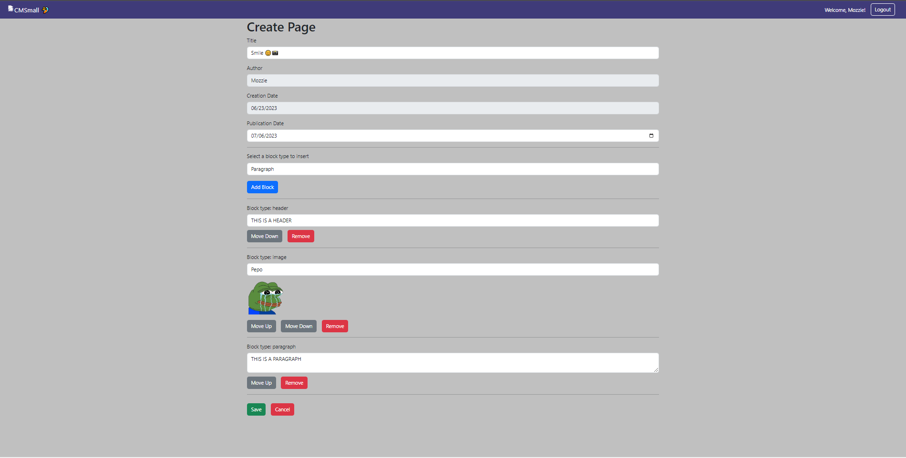

[](https://classroom.github.com/a/8AapHqUJ)
# Exam #1: "CMSmall"
## Student: s319826 ZUNINO GIACOMO 

## React Client Application Routes

- Route `/`: default layout => for every user (loggedIn or not) it shows the list of all published pages ordered by publication date with an action button (link to the page). If the user is authenticated it shows also a button (Se All) that send the user to a new route where all the pages are displayed (published, drafted and scheduled)
- Route `/pages/all`: if the user is loggedIn it shows the list of all pages (published, drafted and scheduled) with action buttons (link to the page and, if the user is the owner of the page or an admin it shows also the edit and delete buttons ), if not loggedIn, the not authenticated user will be redirect to the login form
- Route `/pages/:id`: this route shows all information about a page with a specific ID, passed in the URL. The information that is displayed  is: title, author, date of creation, date of publication (if present) with the status of it (published, scheduled, drafted) and the blocks (headers, paragraphs and images)
- Route `/pages/add`: this route will send a loggedIn user to a form, where he can add a new page
- Route `/pages/:id/edit`: this route will send a loggedIn user to a form, where he can edit his page. If the user is an admin he can edit also someone else page, changing also the owner of the page. The param passed in the URL is the id of the page that will be modified
- Route `/login`: this route will send a user, who is not loggedIn, to a page where he can insert his username and password and login. If a user that is already loggedIn try to go to this route, he will be sent to the home page with the route = `/`
- Route `*`: content not found (URL with non-existent page related to a certain param or an unauthorized user attempted to access a path without permission)

## API Server

### Page Mangagement

#### Get all Pages

* HTTP method: `GET`  URL: `/api/pages`
* Description: Get the full list of pages (all pages if the user is loggedIn, only published ones if the user is not loggedIn)
* Request body: _None_
* Request query parameter: userId, needed to check if there is a loggedIn user or not and choose the right query
* Response: `200 OK` (success)
* Response body: Array of objects, each describing one page:

``` json
[
  {
    "pageId": 1,
    "title": "Title of Page 1",
    "name": "TestUser",
    "user": 1,
    "creationdate": "2023-06-02",
    "pubdate": "2023-06-27",
  },
  {
    "pageId": 2,
    "title": "Title of Page 2",
    "name": "Mozzie",
    "user": 2,
    "creationdate": "2023-05-27",
    "pubdate": "2023-06-17",
  },
  ...
]
```

* Error responses:  `500 Internal Server Error` (generic error)

#### Get all Ordered Pages

* HTTP method: `GET`  URL: `/api/pages/ordered`
* Description: Get the list of pages ordered by publication date (only pages with a publication date are displayed) 
* Request body: _None_
* Request query parameter: _None_
* Response: `200 OK` (success)
* Response body: Array of objects, each describing one page, ordered by publication date:

``` json
[
  {
    "pageId": 2,
    "title": "Title of Page 2",
    "name": "Mozzie",
    "user": 2,
    "creationdate": "2023-05-27",
    "pubdate": "2023-06-17",
  },
  {
    "pageId": 1,
    "title": "Title of Page 1",
    "name": "TestUser",
    "user": 1,
    "creationdate": "2023-06-02",
    "pubdate": "2023-06-27",
  },
  ...
]
```

* Error responses:  `500 Internal Server Error` (generic error)

#### Get Page

* HTTP method: `GET`  URL: `/api/pages/:id`
* Description: Get all the information about a single page given its pageId, passed by params 
* Request body: _None_
* Request query parameter: pageId
* Response: `200 OK` (success)
* Response body: Array of blocks that are part of a page, ordered by position, containing all blocks, page and author info:

``` json
[
  {
    "idblock": 2, 
    "type": "header", 
    "content": "there is an header", 
    "position": 1, 
    "title": "Title of Page 1", 
    "author": "TestUser", 
    "creationdate": "2023-06-02", 
    "pubdate": "2023-06-27", 
    "id": 1, 
    "role": "User"
  },
  {
    "idblock": 1, 
    "type": "image", 
    "content": "there is an image", 
    "position": 2, 
    "title": "Title of Page 1", 
    "author": "TestUser", 
    "creationdate": "2023-06-02", 
    "pubdate": "2023-06-27", 
  },
  ...
]
```

* Error responses:  `500 Internal Server Error` (generic error), `404` (Not Found)

#### Get Page (for the edit, needed to avoid problematic url changes)

* HTTP method: `GET`  URL: `/api/pages/:id/ToEdit`
* Description: Get all the information about a single page given its pageId (passed by params) only to the owner of the page or to an admin
* Request body: _None_
* Request query parameter: pageId, user
* Response: `200 OK` (success)
* Response body: page info:

``` json
{
  "title": "Title of Page 1", 
  "author": "TestUser", 
  "creationdate": "2023-06-02", 
  "pubdate": "2023-06-27", 
}
```

* Error responses:  `500 Internal Server Error` (generic error), `404` (Not Found)

#### Delete Page

* HTTP method: `DELETE`  URL: `/api/pages/:id`
* Description: Delete an existing page
* Request body: _None_
* Request query parameter: _None_
* Response: `200 OK` (success)
* Response body: _None_
* Error responses:  `503` (generic error)

#### Get Title Web App

* HTTP method: `GET`  URL: `/api/titleWebApp`
* Description: Get the title of the web app
* Request body: _None_
* Request query parameter: _None_
* Response: `200 OK` (success)
* Response body: id and title:

``` json
{
  "id": 1,
  "title": "CMSmall"
}
```

* Error responses:  `500 Internal Server Error`

#### Put Title Web App

* HTTP method: `GET`  URL: `/api/titleWebApp`
* Description: Get the title of the web app
* Request body: oldTitle and newTitle:

``` json
{
  "newTitle": "CMSmall", 
  "oldTitle": "CMSmall 🏄‍♂️"
}
```

* Request query parameter: _None_
* Response: `200 OK` (success)
* Response body: _None_:
* Error responses:  `500 Internal Server Error`

#### POST add a new page

* HTTP method: `POST`  URL: `/api/pages/add`
* Description: add a new page (only if the user is loggedIn)
* Request body: needed information to create a new page:

``` json
{
  "title": "Title of Page 1",
  "user": 1,
  "creationdate": "2023-06-02",
  "pubdate": "2023-06-27",
  "blocks": "blocks"
}
```

* Request query parameter: _None_
* Response: `200 OK` (success)
* Response body: _None_
* Error responses:  `500 Internal Server Error` (generic error), `422 Missing parameters` (Some parameters are empty)

#### Get Blocks

* HTTP method: `GET`  URL: `/api/blocks/:pageId`
* Description: Get all the information about every blocks that are part of a page with a pageId passed by param
* Request body: _None_
* Request query parameter: pageId (id of the page)
* Response: `200 OK` (success)
* Response body: Array of blocks that are part of a page, ordered by position (key is also the position, but I need the field key for the map):

``` json
[
  {
    "idblock": 2, 
    "type": "header", 
    "content": "this is an header", 
    "pageId": 1,
    "position": 1, 
    "key": 1
  },
  {
    "idblock": 1, 
    "type": "image", 
    "content": "path of the image", 
    "pageId": 1,
    "position": 2, 
    "key": 2
  },
  {
    "idblock": 3, 
    "type": "paragraph", 
    "content": "this is a paragraph", 
    "pageId": 1,
    "position": 3, 
    "key": 3
  },
  ...
]
```

* Error responses:  `500 Internal Server Error`

#### Get all users

* HTTP method: `GET`  URL: `/api/users`
* Description: Get the list of users (only if the user is loggedIn and, in this webApp, this API is called only by an admin)
* Request body: _None_
* Request query parameter: _None_
* Response: `200 OK` (success)
* Response body: Array of objects, each describing an user:

``` json
[
  {
    "id": 1, 
    "email": "testuser@polito.it", 
    "name": "TestUser", 
    "role": "User"
  },
  {
    "id": 2, 
    "email": "admin@polito.it", 
    "name": "Admin", 
    "role": "Admin"
  },
  {
    "id": 3, 
    "email": "mozzie@polito.it", 
    "name": "Mozzie", 
    "role": "User"
  },
  ...
]
```

* Error responses:  `500 Internal Server Error`

#### PUT edit a page

* HTTP method: `POST`  URL: `/api/pages/:pageId/edit`
* Description: edit an existing page (only if the loggedIn user is the owner or an admin)
* Request body: needed information to create a new page:

``` json
{
  "title": "Title of Page 1",
  "user": 1,
  "creationdate": "2023-06-02",
  "pubdate": "2023-06-29",
  "blocks": "blocks"
}
```

* Request query parameter: pageId (id of the page to edit)
* Response: `200 OK` (success)
* Response body: _None_
* Error responses:  `500 Internal Server Error` (generic error), `422` (some parameters are empty)

### User management

#### Login

* HTTP method: `POST`  URL: `/api/sessions`
* Description: authenticate the user who is trying to login
* Request body: credentials of the user who is trying to login

``` JSON
{
  "username": "testuser@polito.it",
  "password": "password"
}
```

* Response: `200 OK` (success)
* Response body: authenticated user

``` JSON
{
  "id": 1,
  "username": "testuser@polito.it", 
  "name": "TestUser"
}
```

* Error responses:  `500 Internal Server Error` (generic error), `401 Unauthorized User` (login failed)

#### Check if user is logged in

* HTTP method: `GET`  URL: `/api/sessions/current`
* Description: check if current user is logged in and get her data
* Request body: _None_
* Response: `200 OK` (success)

* Response body: authenticated user

``` JSON
{
  "id": 1,
  "username": "testuser@polito.it", 
  "name": "TestUser"
}
```

* Error responses: `500 Internal Server Error` (generic error), `401 Unauthorized User` (user is not logged in)

#### Logout

* HTTP method: `DELETE`  URL: `/api/sessions/current`
* Description: logout current user
* Request body: _None_
* Response: `200 OK` (success)

* Response body: _None_

* Error responses: `500 Internal Server Error` (generic error), `401 Unauthorized User` (user is not logged in)

## Database Tables

- Table `users` - contains: id, email, name, hash, salt, role &emsp;&emsp;&emsp;&emsp;&emsp;&emsp;( *PRIMARY KEY*: id )
- Table `pages` - contains: pageId, title, user, creationdate, pubdate &emsp;&emsp;( *PRIMARY KEY*: pageId, *FOREIGN KEY*: user(id) )
- Table `blocks` - contains: idblock, type, content, pageId, position &emsp;  &emsp;( *PRIMARY KEY*: idblock, *FOREIGN KEY*: pageId )
- Table `webapp` - contains: id, title&emsp;&emsp;&emsp;&emsp;&emsp;&emsp;&emsp;&emsp; &emsp;&emsp;  &emsp;&emsp;&emsp;&emsp;&emsp;&emsp;( *PRIMARY KEY*: id )

## Main React Components

- `LoginForm` (in `AuthComponent.jsx`): it shows a form for inserting credentials (username and password) for login. On submit the form validates the inserted data  (email format, not empty fields) before sendig the request to the server
- `LoginButton` and `LogoutButton` (in `AuthComponent.jsx`): these buttons are place on the top-right of the screen, inside the navbar. When a user is loggedIn, the logOut button is displayed and vice versa for the login button (that if it is clicked, he will send the user to the login form)

- `FormPage` (in `FormPage.jsx`): This react component contains a form, which allows the user (admin or regular) to add a new page or edit an existing one (only if the user is the owner or an admin)
To **create** a new page you need to have: a title, an author (automatically inserted using the info of the loggedIn user who's performing the add), a creation date (automatically inserted), a publication date (could be null) and a list of blocks (at least an header and a paragraph/image).
A block consists of images, headers or paragraphs and, during the creation of the page, they can be added, removed or moved (Down or Up). If there are some empty fields, like title, or there are not enough blocks, the user can't add the new page. It will appear an alert saying what is missing.
For the **edit**, a regular user can change the title, the publication date and add, remove or move the blocks. Again there are checks to see if all the necessary elements are there.
An admin can edit all the pages he want, even if he's not the owner, and he can also change the author, choosing from a list of user that are stored in the db.
In the route there is the pageId (passed as param) and is used to take from the database all the info about the blocks that are inside the page. 
The information about the page are passed as a props from the _EditLayout_ component and then the blocks that are related to this page are obtained from an API function.

- `NavHeader` (in `NavbarComponents.jsx`): This react component is used to create the navbar, that contains, on the left, the title and logo of the webApp and, on the right, the button for login or logout

- `NotFound` (in `NotFoundComponent.jsx`): This react component is used when a user try to reach a route that doesn't exist or he can't access it

- `DefaultLayout` (in `PageLayout.jsx`): This react component is used to set up a default layout, in this case it's a single component that will be placed in all the webbApp. It's composed by a row and single column that cover all the display. Inside the col there is an Outlet, where the component called by the route will be placed
- `MainLayoutLoggedIn` (in `PageLayout.jsx`): This react component displays a table containing a list of pages with their information (like title, author, creation date, publication date and some action buttons related to each page).
Here a user can see all the pages that are in the database, so this table contains published, drafted and scheduled pages.
If the user is an admin or the owner of the page, the action buttons will be: link to the single page, edit page and delete.
If the user is not the owner of the page, there will be only one button, the one who send the user to the single page component.
Next to the Title text in the first column of the first row with all fields, there is an ADD button (icon with a '+' incide a circle) which redirect the user to the form page, to create a new page
In case an admin is loggedIn, a button will appear near the title. With this button he can modify the title of the website (client and server sides).
Under the table
Here there are also the functions related to each button described before and they are passed to the PageList component as a props (deletePage, getOrderedPages, pages), with the loggedIn user information and the list of pages.
Under the table, on the right, there is a button that send the user to the _MainLayout_ component, where he can see a list of ordered pages, like a not authenticated user.
Another feature in this component is the possibility to sort all the pages by publication date (a page need to be published, so drafted and scheduled pages will not be shown).
The function to retrieve the list of pages is inside a _useEffect_ (allows components to react to lifecycle events)
- `MainLayout` (in `PageLayout.jsx`): This react component displays a table containing a list of pages with their information (like title, author, creation date, publication date and some action buttons related to each page). This is for loggedIn user.
In this case, only published pages are shown sorted by publication date. The only button that the user can use is the one that redirect him to the single page component.
Under the table, on the right, there is a button that send the user to the _MainLayoutLoggedIn_ component, where he can see all the pages.
Here there is the function to get the list of ordered pages (inside a useEffect).
- `MainLayoutNotLogged` (in `PageLayout.jsx`): This react component displays a table containing a list of pages with their information (like title, author, creation date, publication date and some action buttons related to each page).
This is only for not loggedIn user.
In this case, only published pages are shown sorted by publication date. The only button that the user can use is the one that redirect him to the single page component.
Here there is the function to get the list of ordered pages (inside a useEffect).
- `LoadingLayout` (in `PageLayout.jsx`): This react component it's used when the web application is loading something. if the _useState_ (used for storing variables that are part of your application's state and will change as the user interacts with your website) 'loading' is true, the user will be sent to the loading page, if not, to the default layout
- `EditLayout` (in `PageLayout.jsx`): This react component it's used call an API function that can return info of a page or an error. If the pageId passed to the function is not related to a page in the db, or the user that is trying to edit the page is not the owner (and not an admin), it will return an error and send the user to the _NotFound_ route.
If the page exists, the next step is pass these page information to the _FormPage_ component, with user information and the flag to tell if you are editing or create a new page.
Check if the user is the owner (or an admin) is important to avoid that a user change the id in the url to try to edit another user page without permission

- `PageList` (in `PageList.jsx`): This react component is used to set the table used to display the page list, with all the buttons that I mentioned before in the _MainLayout component_.
The page list is mapped and,  at each iteration, the react component _PageRow_ is "called" and some elements are passed as props (deletePage, user, page)
- `PageRow` (in `PageList.jsx`): This react component receives a page (from the map done in the _PageList component_) and insert, in each field of the table, the page attributes (pageId, title, author, creationdate and pubdate) and the buttons.

- `SinglePage` (in `SinglePage.jsx`): This component dispalys a single page, obtained by the id passed as param in the URL. 
The component divides the screen in three columns, with the central one that is bigger than the others.
In the right column there will be all the information about the page, such as author, creation date, publication date (if present) and his state related to the publication date (published, scheduled and drafted).
In the central column there are the title and the blocks, that are the main content of the page. Blocks could be headers, images and paragraphs and each page must have at least one header and one image or paragraph.
Title, creation date, publication date and author are obtained with the function that return a list of blocks that are part of the page (getPageBlocks). This function is called in a _useEffect_ and if it returns an error (the id passed as param doesn't match any pages in the database) a navigate will send the user to the _NotFound_ path.
Then the block list is mapped and each block is passed to the _SingleBlock component_ as a props, with the print function 
- `SingleBlock` (in `SinglePage.jsx`): This component receives a block as a props with the print function. The print function checks the type of the block and chooses the correct format for displaying the block content 


## Screenshot





## Users Credentials

Here you can find a list of the users already registered inside the provided database.

|         email         |   name   | plain-text password | role |
|-----------------------|----------|---------------------|------|
| john.doe@polito.it    | John     | password            | User |
| mario.rossi@polito.it | Mario    | password            | User |
| testuser@polito.it    | Testuser | password            | User |
| admin@polito.it       | Admin    | password            | Admin|
| mozzie@polito.it      | Mozzie   | password            | User |
